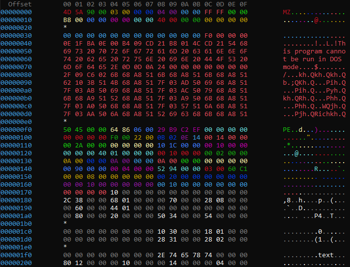

<!-- These are examples of badges you might want to add to your README:
     please update the URLs accordingly

[](https://cirrus-ci.com/github/<USER>/cxd)
[](https://cxd.readthedocs.io/en/stable/)
[](https://coveralls.io/r/<USER>/cxd)
[](https://pypi.org/project/cxd/)
[](https://anaconda.org/conda-forge/cxd)
[](https://pepy.tech/project/cxd)
[](https://twitter.com/cxd)
-->

[](https://pyscaffold.org/)

# cxd

> Colored heX Dump



## Setup

Note: the project needs Python 3.10 or superior.

```shell
python3 -m venv venv
. venv/bin/activate
# putup cxd
cd cxd
pip install -e .
# for offline locations
# pip wheel . --wheel-dir /path
```

## Usage

0. Optional. Define a coloration scheme (read [sample_colors_ranges.txt](src/cxd/sample_colors_ranges.txt) if you need an example).

Columns are under the format "start,length[,color]":

   * start and length must be decimal or hexadecimal integers
   * if provided, color must be in "black red green yellow blue magenta cyan white light_grey dark_grey light_red light_green light_yellow light_blue light_magenta light_cyan".
   These colors are defined [here](https://pypi.org/project/termcolor/).

1. Use ``cxd``:

```shell
cxd -d path/to/binary/file -c src/cxd/sample_colors_ranges.txt
cxd -h
```

Or if you want to integrate ``cxd`` in your Python code:

```python
from colorama import just_fix_windows_console
from cxd import ColorRange, ColoredHexDump
import string

# for Windows
just_fix_windows_console()

# define your colors ranges
ranges = [ColorRange(0, 4, 'red'), ColorRange(4, 4, 'green'), ColorRange(8, 4, 'blue')]
cxd = ColoredHexDump(ranges=ranges, chunk_length=16)
cxd.print(string.printable.encode())
```

See the function `ColoredHexDump.__init__` in [colored_hex_dump.py](src/cxd/colored_hex_dump.py) to see all options.

## Configuration

Colors are provided to `cxd` with the option "-c".
You can also modify some settings with a configuration file. To do so:

```shell
cxd_genconf --configuration-path path/to/your/new/configuration.json
```

A JSON file will be created with some default options.

You can now use this configuration file with the option "-k" / "--configuration".

Accepted colors can be found [here](https://pypi.org/project/termcolor/); they are:
- "black"
- "red"
- "green"
- "yellow"
- "blue"
- "magenta"
- "cyan"
- "white"
- "light_grey"
- "dark_grey"
- "light_red"
- "light_green"
- "light_yellow"
- "light_blue"
- "light_magenta"
- "light_cyan"

The explanation for the field "stop_at_first_color_found" is as follows: as multiples colors ranges may hold a perticular offset, this value allows to stop the search at the first result found.
If it is not set, the last color found is used.

## Parsers

Currently, only one *real* parser exists, and it uses the excellent project [pefile](https://github.com/erocarrera/pefile).

```shell
pip install cxd[parsers]
```

Available parsers:

- `pe`: works on all systems
- `strings`: only works on Linux platforms

If you want to add your own parser `foo`, create a script called `parser_foo.py` in [src/cxd/parsers](src/cxd/parsers).
Inside, create a class `FooColorer`, with the methods `__init__`, `check` and `parse`, as already done in [parser_pe.py](src/cxd/parsers/parser_pe.py) and [parser_strings.py](src/cxd/parsers/parser_strings.py).

If you need to add some dependencies, add them in the file [setup.cfg](setup.cfg), in the section `[options.extras_require]`, in the `parsers` list.


## Test

```shell
pip install cxd[testing]
pytest
```


<!-- pyscaffold-notes -->

## Note

This project has been set up using PyScaffold 4.3.1. For details and usage
information on PyScaffold see https://pyscaffold.org/.
